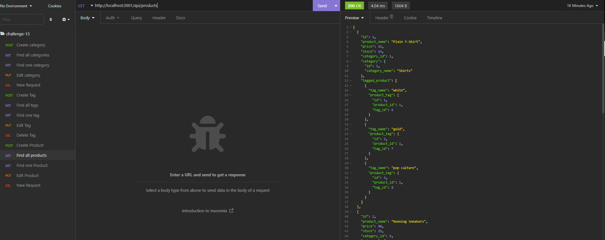

# Ecom-DB

## Purpose 

To make a fully-functioning back end that uses the latest technologies. This back end will later be integrated with robust front end that will blow other e-commerce companies out of the water!

## Installation 

For this app you'll need to install MySQL, Sequelize, dotenv, and express

## Built With 

* JS

* NODEJS

## Example

## Demonstration Link

[Demo](https://drive.google.com/file/d/1RoI-PUVDSPXCFEAoUdAOdvqYYS2NY98n/view)